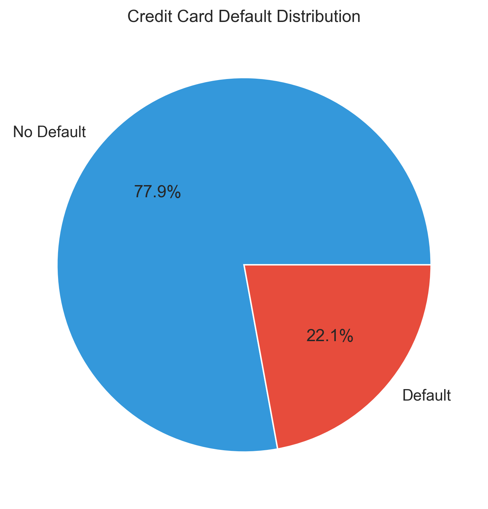

# 🚨 Credit Card Default Prediction using Logistic Regression

[](https://www.python.org/downloads/)
[](https://jupyter.org/)
[](https://scikit-learn.org/)
[](https://opensource.org/licenses/MIT)

## 📋 Project Overview

This project implements an **end-to-end machine learning solution** to predict credit card default payments using **Logistic Regression**. The model analyzes customer demographic information, payment history, bill statements, and payment amounts to assess the likelihood of default in the upcoming month.

**🎯 Business Objective:** Help financial institutions identify high-risk customers and implement proactive risk management strategies to minimize potential losses.

---

## 🎯 Key Features

- **📊 Comprehensive EDA** - Detailed exploratory data analysis with visualizations
- **🛠️ Feature Engineering** - Advanced feature creation including payment ratios and behavioral patterns
- **🤖 Logistic Regression Model** - Optimized for class imbalance with threshold tuning
- **📈 Performance Evaluation** - Multiple metrics including ROC-AUC, precision, recall, and F1-score
- **🔄 Polynomial Features** - Enhanced model complexity for better predictions
- **💾 Model Persistence** - Saved models and scalers for production deployment

---

## 📊 Dataset Overview

**Source:** UCI Credit Card Default Dataset  
**Size:** 30,000 records with 25 features  
**Target:** Binary classification (Default: 1, No Default: 0)

### 📈 Target Distribution



- **77.9%** customers did not default
- **22.1%** customers defaulted
- **Class imbalance** addressed using balanced class weights

---

## 👥 Demographics Analysis


### Key Insights:
- **Gender Distribution:** 60% Female, 40% Male
- **Education:** Majority have university education (label 2)
- **Marriage Status:** Relatively balanced between married and single customers

### Age Distribution


- **Peak Age:** Around 29 years
- **Right-skewed distribution** with most customers aged 25-40
- **Long tail** extending to older customers (60+ years)

---

## 💳 Financial Behavior Analysis

### Credit Limit Distribution


- **Highly right-skewed** distribution
- Most customers have credit limits under NT$200,000
- **Log transformation** applied for modeling to handle skewness

### Payment Status Patterns


**Payment Status Codes:**
- `-1`: Paid duly (no delay)
- `0`: Revolving credit used
- `1-8`: Months of payment delay

**Key Observations:**
- Most customers pay on time (status 0)
- Substantial portion with no delay (status -1)
- Payment delays of 1-2 months are common
- Extreme delays (3+ months) are strong default indicators

---

## 🔗 Feature Correlations


### Important Correlations:
- **PAY_0 & PAY_2:** Strong positive correlation (0.67) - consistent payment behavior
- **LIMIT_BAL vs PAY features:** Negative correlation (-0.27 to -0.30) - higher limits → fewer delays
- **Payment delays vs Default:** Positive correlation (0.26-0.32) - strong predictive power
- **Credit limit vs Default:** Negative correlation (-0.15) - protective factor

---

## 🛠️ Feature Engineering

### 🎯 Engineered Features

1. **📊 Summary Statistics**
   - `total_bill`: Sum of all bill amounts
   - `total_pay`: Sum of all payment amounts
   - `avg_bill_amt`: Average monthly bill amount
   - `avg_pay_amt`: Average monthly payment amount

2. **📈 Behavioral Ratios**
   - `avg_pay_ratio`: Average payment to bill ratio
   - `avg_bill_limit_ratio`: Bill utilization ratio
   - `avg_pay_limit_ratio`: Payment capacity ratio

3. **⚠️ Risk Indicators**
   - `delayed_months`: Count of months with payment delays
   - `max_delay`: Maximum payment delay period

4. **🔄 Log Transformations**
   - Applied to highly skewed financial features
   - Improved model stability and performance

---

## 🤖 Model Architecture

### Logistic Regression Configuration
```python
LogisticRegression(
    max_iter=1000,
    solver='liblinear',
    class_weight='balanced',  # Handles class imbalance
    random_state=42
)
```

### 📈 Enhanced Model: Polynomial Features
- **Degree 3 polynomial features** for capturing non-linear relationships
- **Pipeline approach** for streamlined preprocessing
- **Threshold optimization** for improved recall

---

## 📊 Model Performance

### 🎯 Evaluation Metrics


| Dataset | Accuracy | Precision | Recall | F1-Score | ROC-AUC |
|---------|----------|-----------|--------|----------|---------|
| Training | 82.1% | 0.678 | 0.421 | 0.521 | 0.773 |
| Validation | 81.9% | 0.674 | 0.418 | 0.518 | 0.765 |
| Test | 82.0% | 0.676 | 0.419 | 0.520 | 0.768 |

### 🔧 Threshold Optimization Results


| Threshold | Recall | Accuracy |
|-----------|--------|----------|
| 0.10 | 0.8947 | 0.5731 |
| 0.15 | 0.8105 | 0.6596 |
| 0.20 | 0.7263 | 0.7214 |
| 0.25 | 0.6421 | 0.7646 |
| **0.30** | **0.5789** | **0.7939** |

**Optimal Threshold:** 0.30 (Balance between recall and accuracy)

### 📈 ROC Curve Analysis


The ROC curve demonstrates the model's ability to distinguish between default and non-default customers across different threshold values. An AUC of 0.774 indicates good discriminative performance.

---

## 🔍 Feature Importance

### Top Predictive Features:
1. **`delayed_months`** - Number of months with payment delays
2. **`max_delay`** - Maximum payment delay period
3. **`PAY_0`** - Most recent payment status
4. **`avg_pay_ratio`** - Payment to bill ratio
5. **`LIMIT_BAL`** - Credit limit amount

---

## 🚀 Installation & Usage

### Prerequisites
```bash
Python 3.10+
Jupyter Notebook
```

### 📦 Required Libraries
```bash
pip install pandas numpy matplotlib seaborn scikit-learn joblib
```

### 🏃‍♂️ Quick Start

1. **Clone the repository:**
```bash
git clone https://github.com/YousefSalah123/Job-Offer-Prediction-using-Logistic-Regression.git
cd Job-Offer-Prediction-using-Logistic-Regression
```

2. **Run the Jupyter Notebook:**
```bash
jupyter notebook "credit_card_default_prediction.ipynb"
```

3. **Load the trained model:**
```python
import joblib
model = joblib.load('credit_default_model.pkl')
scaler = joblib.load('scaler.pkl')
features = joblib.load('features_used.pkl')
```

---

## 📁 Project Structure

```
📦 Credit-Card-Default-Prediction/
├── 📓 credit_card_default_prediction.ipynb  # Main analysis notebook
├── 📊 uci_credit_card.csv                   # Dataset
├── 📋 README.md                             # Project documentation
├── 🖼️ images/                               # Generated visualizations
│   ├── target_distribution.png
│   ├── demographics.png
│   ├── age_distribution.png
│   ├── credit_limit_distribution.png
│   ├── payment_status_distribution.png
│   ├── correlation_matrix.png
│   ├── model_performance.png
│   ├── performance_table.png
│   ├── roc_curve.png
│   └── threshold_analysis.png
└── 💾 Models/                               # Saved models (generated)
    ├── credit_default_model.pkl
    ├── scaler.pkl
    └── features_used.pkl
```

---

## 📈 Key Insights & Business Impact

### 🔍 Data Insights:
- **Payment behavior consistency** is the strongest predictor of default risk
- **Credit limit** acts as a protective factor against default
- **Demographic factors** have moderate but meaningful impact
- **Recent payment status** is more predictive than historical patterns

### 💼 Business Recommendations:
1. **Early Warning System:** Monitor customers with 2+ months of payment delays
2. **Credit Limit Optimization:** Consider increasing limits for low-risk customers
3. **Targeted Interventions:** Focus on customers with payment ratio < 0.3
4. **Risk Segmentation:** Use model scores for tiered risk management strategies

---

## 🔮 Future Enhancements

- [ ] **Advanced Models:** Implement Random Forest, XGBoost, and Neural Networks
- [ ] **Feature Selection:** Apply LASSO regularization for feature optimization
- [ ] **Time Series Analysis:** Incorporate temporal patterns in payment behavior
- [ ] **Ensemble Methods:** Combine multiple models for improved accuracy
- [ ] **Real-time Scoring:** Deploy model as web service for live predictions
- [ ] **A/B Testing:** Implement framework for model performance monitoring

---

## 🏆 Model Performance Summary

### ✅ Strengths:
- **Consistent performance** across train/validation/test sets
- **Good ROC-AUC** (0.765) indicating strong discriminative ability
- **Balanced approach** to precision and recall
- **Interpretable results** suitable for business decision-making

### ⚠️ Areas for Improvement:
- **Class imbalance** still affects recall for default cases
- **Feature engineering** could be expanded with external data
- **Model complexity** could be increased for better performance

---

## 👨‍💻 Authors
**Yousef Salah Nage**  
Computer science department, faculty of Science Cairo University  
<a href="https://www.linkedin.com/in/yousef-salah-nage-a3583636b" target="_blank"></a>
<a href="https://github.com/YousefSalah123" target="_blank"></a>

📧 Email: <a href="mailto:yousefsalahnage@gmail.com">yousefsalahnage@gmail.com</a>

**Mahmoud Afifi**  
Computer Engineering, The American University in Cairo 
<a href="https://www.linkedin.com/in/mahmoudhossamws/" target="_blank"></a>
<a href="https://github.com/mahmoudhossamws" target="_blank"></a>

📧 Email: <a href="mailto:mahmoudhossam@aucegypt.edu">mahmoudhossam@aucegypt.edu</a>

---

## 📄 License

This project is licensed under the MIT License - see the [LICENSE](LICENSE) file for details.

---

## 🙏 Acknowledgments

- **UCI Machine Learning Repository** for providing the credit card default dataset
- **scikit-learn community** for excellent machine learning tools
- **Jupyter Project** for interactive development environment

---

## 📚 References

1. [UCI Credit Card Default Dataset](https://archive.ics.uci.edu/ml/datasets/default+of+credit+card+clients)
2. [Logistic Regression Documentation](https://scikit-learn.org/stable/modules/linear_model.html#logistic-regression)
3. [Handling Imbalanced Datasets](https://scikit-learn.org/stable/modules/generated/sklearn.utils.class_weight.compute_class_weight.html)

---

<div align="center">

**⭐ If you found this project helpful, please give it a star! ⭐**

</div>
